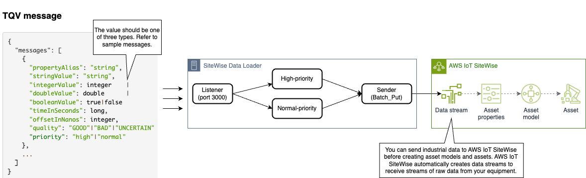
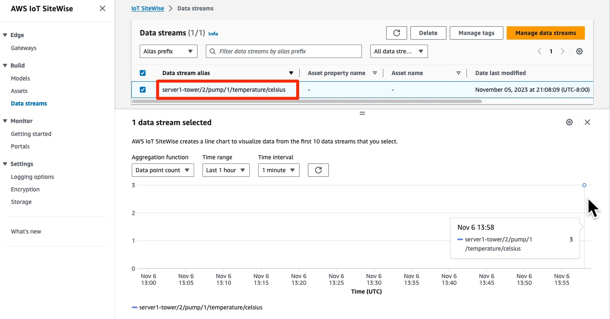

# Sitewise Data Loader

> **NOTE**
>
> This project is intended for reference/example purposes only and is not yet ready for production use.

## Overview

This application is designed to maximize TQVs throughput generated by multiple devices or servers for AWS SiteWise.

- The application has demonstrated impressive speeds, capable of processing **18K to 38K TQVs per second** using the M1 Mac Pro
- There is no need to modify the TQVs to conform to AWS SiteWise BatchPut format. You can simply send either a single entity or a list of TQVs.
- The application provides REST API endpoints, allowing for seamless integration with various applications.
- The application is designed to be portable, requiring only Node.js version 20 (although it is compatible with other Node.js versions).
- The application can be tailored to your needs or environment through configuration options.



## How to start application

1. Clone this repository

    To download the repository, run the following command:

    ```bash
    git clone https://github.com/aws-samples/sitewise-data-loader.git
    cd sitewise-data-loader
    ```

2. Obtain AWS credentials

    There are several ways to provide credentials to the AWS SDK for JavaScript IoTSiteWise Client. One way is to use the AWS CLI to retrieve temporary credentials. For other options, refer to the [AWS Tools and SDKs Shared Configuration and Credentials Reference Guide](https://docs.aws.amazon.com/sdkref/latest/guide/overview.html).

    Open cloudshell or terminal and run the below command.

    ```bash
    aws sts get-session-token
    ```

    You will get the following results.

    ```
    {
      "Credentials": {
          "AccessKeyId": "...",
          "SecretAccessKey": "...",
          "SessionToken": "...",
          "Expiration": "2023-01-01T00:00:01Z"
      }
    }
    ```

    Next, set your AWS access key as environment variables to your local terminal.

    ```bash
    export AWS_ACCESS_KEY_ID="The AccessKeyId value of the result above"
    export AWS_SECRET_ACCESS_KEY="The SecretAccessKey value of the result above"
    export AWS_SESSION_TOKEN="The SessionToken value of the result above"
    ```

3. Build component

    ```bash
    npm install
    npm run build
    ```

4. Run your application in production mode.

    This application can be run using either method.

    4.1 Run with npm.

    ```bash
    npm run start:prod
    ```

    4.2 Run with nodejs.
    In the `dist` folder, you will find the file `sitewise-data-loader.js`. You can run this file to check the functionality.

    ```bash
    node sitewise-data-loader
    ```

## How to ingest TQV messages

The following formats are available for the ingestion of TQV messages:

> **NOTE**
>
> AWS IoT SiteWise rejects any data points with timestamps older than 7 days in the past or newer than 10 minutes in the future. Before uploading data using this sample, update the timeInSeconds value to the current time to aviod issues.

-   Single Message
    URL: http://localhost:3000/listener/message

```
{
  "propertyAlias": "server1-tower/2/pump/1/temperature/celsius",
  "doubleValue": 23.5,
  "timeInSeconds": 1685426946,
  "priority" : "high"
}
```

-   Batch
    URL: http://localhost:3000/listener/batch

```
{
  "messages": [
    {
      "propertyAlias": "server1-tower/2/pump/1/temperature/celsius",
      "doubleValue": 23.45,
      "timeInSeconds": 1685426946
    },
    {
      "propertyAlias": "server1-tower/2/pump/2/rpm",
      "doubleValue": 1000,
      "timeInSeconds": 1685426946
    },
    {
      "propertyAlias": "server1-tower/2/pump/1/temperature/celsius",
      "doubleValue": 24.1,
      "timeInSeconds": 1685426947
    }
  ]
}
```

### Verify the ingested Data streams from AWS Console

To view the newly created data stream in AWS IoT SiteWise, follow these steps:

1. In the AWS IoT SiteWise console, go to the Build section and select Data streams. 

2. In the list of data streams, you will see the new data stream with the propertyAlias name set as the data stream alias. 

3. To view the ingestion details, check the box next to the data stream and expand the details page. This will show information such as the last ingestion time, ingestion status, and number of assets processed.



## How to configure the component

The component reads its environmental variables, which are the following:

```
REGION=us-east-1
ENVIRONMENT=prod
CLUSTER_MODE=false

SENDER_MAX_TIMEOUT=1000
SENDER_CONCURRENCY=10       // Recommended to set it to 2 to 4 times the number of CPU cores.
SENDER_MAX_RETRY=2
SENDER_RETRY_DELAY=600000   // Failed items will be retried in 10 minutes (ms)

PROPERTY_VALUE_STORAGE_NUM_OF_PT=10 // Number of partitions, set this to 1 to 2 times the number of CPU cores
PROPERTY_VALUE_STORAGE_SIZE_OF_PT=4294967296
PROPERTY_VALUE_STORAGE_INTERVAL=0   // Data aggregation interval (ms)
```

## See more information

You can find more information about this component from [here](./doc/DESIGN.md).
