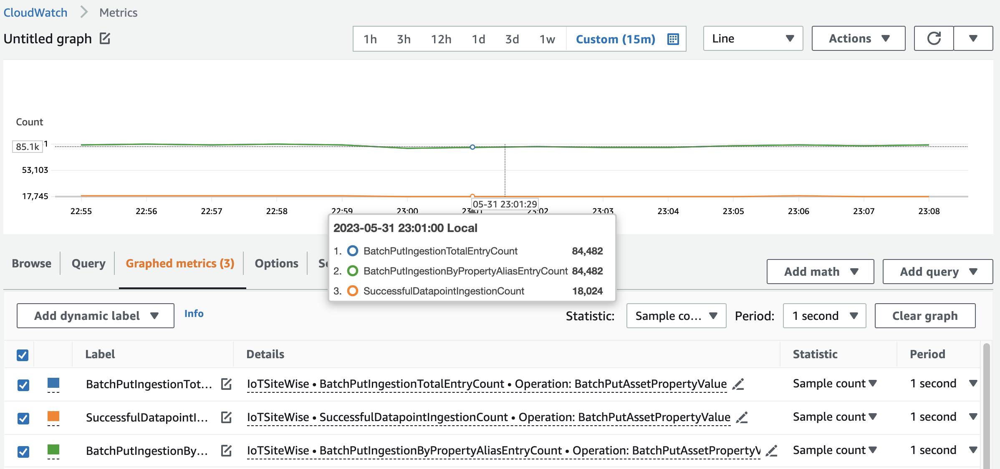
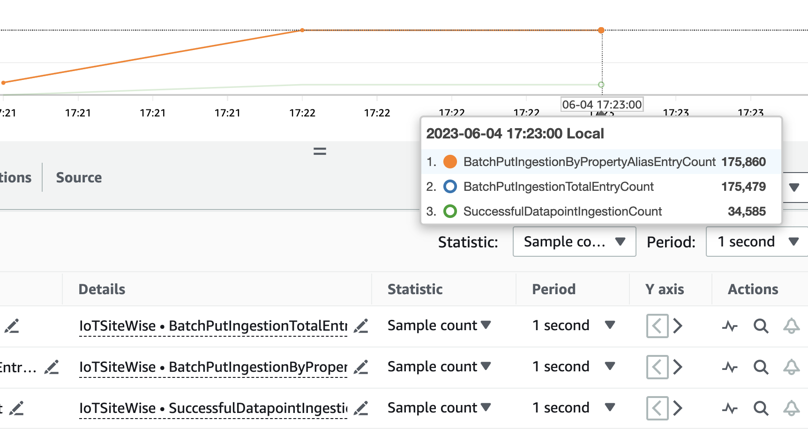
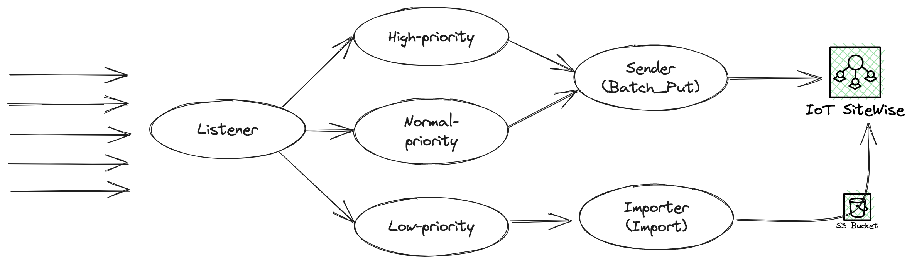
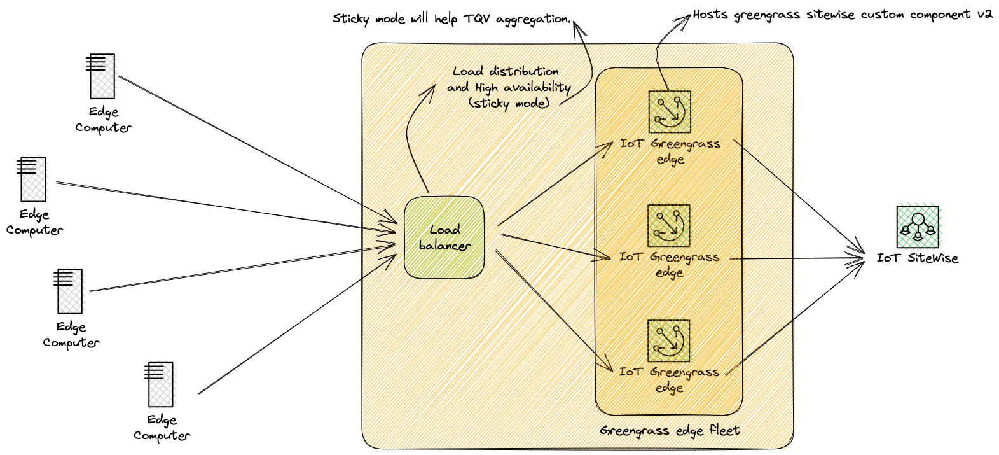
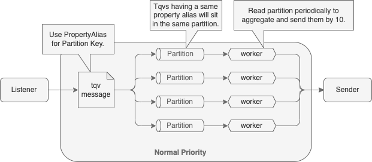
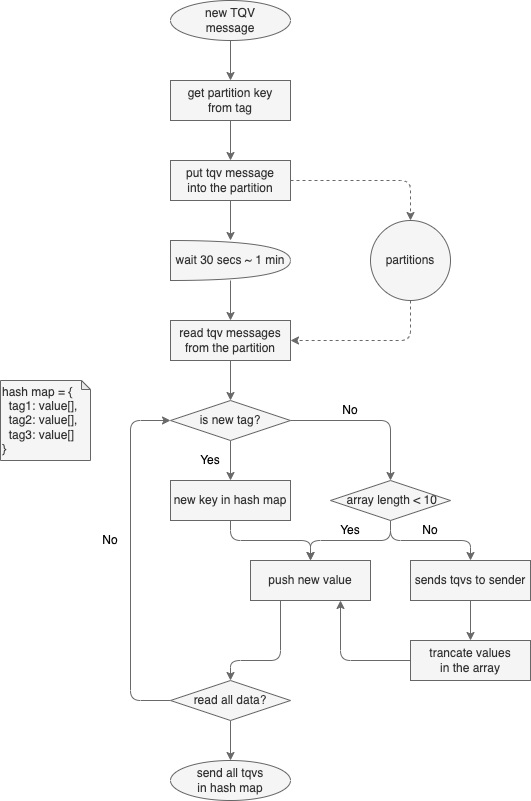
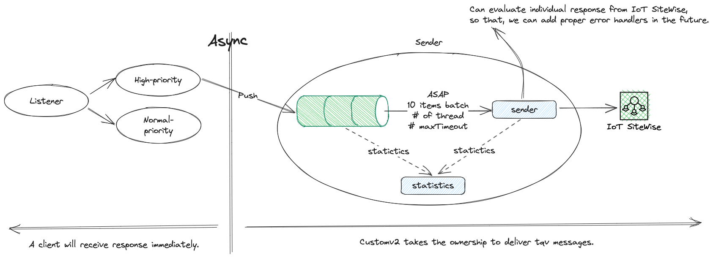
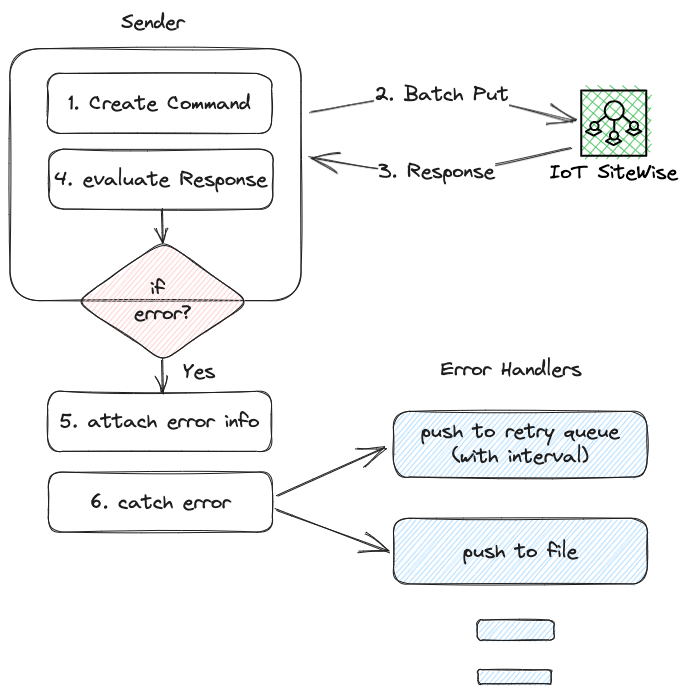

# SiteWise Data Loader Design

## Configuration

You can handle component configuration using environmental variables. Followings are configurable items.

```
REGION=us-east-1
ENVIRONMENT=prod

SENDER_MAX_TIMEOUT=1000
SENDER_CONCURRENCY=30
SENDER_MAX_RETRY=2
SENDER_RETRY_DELAY=600000 // 10 mins

PROPERTY_VALUE_STORAGE_NUM_OF_PT=30
PROPERTY_VALUE_STORAGE_SIZE_OF_PT=4294967296
PROPERTY_VALUE_STORAGE_INTERVAL=0
```

You can run this `node sitewise-custom-component`.

## Updates

-   2023-06-02: You can compile with command `npm run build`. As a result of build, you can check `dist/siteWiseCustomComponent.js`. Now you don't need entire repo, you can just copy & paste it for deployment.
-   2023-06-04: You can enable **Cluster Mode** which provides processor level parallelism.

## Problem

1. The SiteWise Gateway with StreamManager runs extremely slow on a single server.
2. The process of creating a "SiteWise Batch" is overly complicated. While it supports 10x10 aggregation, 1x10 aggregation is primarily used in most cases.
3. The current solution only handles errors via retries and drop actions, without providing any recovery options for other complex situations.

## Overview
The purpose of this application is to efficiently transfer data from multiple devices to AWS SiteWise using **a single server or PC**. To achieve this, it utilizes several strategies:

1. Non-blocking IO: This method improves performance by reducing delays caused by "Batch Put" latency. By generating multiple "Batch Put" requests simultaneously, the application minimizes wait times.
2. Message prioritization: The application prioritizes data delivery by attempting to put more messages whenever possible.
3. Data compression(TBD): This application utilizes two compression techniques: dead band compression and swing door compression. These techniques aim to reduce data volume and enhance data quality.
4. Error handling: The application is designed to recognize and address potential errors. If a throttle event occurs in AWS SiteWise, messages will be stored in the retry queue, and retransmission will be attempted after an appropriate back off period.

In addition to the above, this application solves an additional problem. Previously, customers had to provide a complex structure for the "Batch". However, the SiteWise Data Loader automates this process by creating the batch "under the hood".

Furthermore, if an interval for aggregation is not provided for normal priority messages, the application

## Performance

It shows around **10K ~ 25K** (or **35K** for cluster mode) TQVs per second along with the condition how long AWS SiteWise takes time. The result of an application on the west coast sending data to the AWS SiteWise on the east coast is below.

```log
[Nest] 59937  - 06/02/2023, 3:10:02 PM     LOG [SenderStatistic] finishStatistics: completed: {"numberOfBatches":10,"numberOfTqvs":1000,"startTime":1685743802615,"endTime":1685743802676,"durationInMs":61,"tqvsPerSeconds":16393.442622950817,"succeedTqvs":1000,"failedTqvs":0,"now":1685743802676}
[Nest] 59937  - 06/02/2023, 3:10:03 PM     LOG [SenderStatistic] finishStatistics: completed: {"numberOfBatches":10,"numberOfTqvs":1000,"startTime":1685743803236,"endTime":1685743803317,"durationInMs":81,"tqvsPerSeconds":12345.67901234568,"succeedTqvs":1000,"failedTqvs":0,"now":1685743803317}
[Nest] 59937  - 06/02/2023, 3:10:03 PM     LOG [SenderStatistic] finishStatistics: completed: {"numberOfBatches":10,"numberOfTqvs":1000,"startTime":1685743803925,"endTime":1685743803977,"durationInMs":52,"tqvsPerSeconds":19230.76923076923,"succeedTqvs":1000,"failedTqvs":0,"now":1685743803977}
[Nest] 59937  - 06/02/2023, 3:10:04 PM     LOG [SenderStatistic] finishStatistics: completed: {"numberOfBatches":10,"numberOfTqvs":1000,"startTime":1685743804550,"endTime":1685743804614,"durationInMs":64,"tqvsPerSeconds":15625,"succeedTqvs":1000,"failedTqvs":0,"now":1685743804614}
[Nest] 59937  - 06/02/2023, 3:10:05 PM     LOG [SenderStatistic] finishStatistics: completed: {"numberOfBatches":10,"numberOfTqvs":1000,"startTime":1685743805175,"endTime":1685743805242,"durationInMs":67,"tqvsPerSeconds":14925.373134328358,"succeedTqvs":1000,"failedTqvs":0,"now":1685743805242}
[Nest] 59937  - 06/02/2023, 3:10:05 PM     LOG [SenderStatistic] finishStatistics: completed: {"numberOfBatches":10,"numberOfTqvs":1000,"startTime":1685743805768,"endTime":1685743805811,"durationInMs":43,"tqvsPerSeconds":23255.81395348837,"succeedTqvs":1000,"failedTqvs":0,"now":1685743805811}
[Nest] 59937  - 06/02/2023, 3:10:06 PM     LOG [SenderStatistic] finishStatistics: completed: {"numberOfBatches":10,"numberOfTqvs":1000,"startTime":1685743806419,"endTime":1685743806475,"durationInMs":56,"tqvsPerSeconds":17857.14285714286,"succeedTqvs":1000,"failedTqvs":0,"now":1685743806475}
[Nest] 59937  - 06/02/2023, 3:10:07 PM     LOG [SenderStatistic] finishStatistics: completed: {"numberOfBatches":10,"numberOfTqvs":1000,"startTime":1685743807035,"endTime":1685743807115,"durationInMs":80,"tqvsPerSeconds":12500,"succeedTqvs":1000,"failedTqvs":0,"now":1685743807115}
[Nest] 59937  - 06/02/2023, 3:10:07 PM     LOG [SenderStatistic] finishStatistics: completed: {"numberOfBatches":10,"numberOfTqvs":1000,"startTime":1685743807610,"endTime":1685743807651,"durationInMs":41,"tqvsPerSeconds":24390.243902439026,"succeedTqvs":1000,"failedTqvs":0,"now":1685743807651}
[Nest] 59937  - 06/02/2023, 3:10:08 PM     LOG [SenderStatistic] finishStatistics: completed: {"numberOfBatches":10,"numberOfTqvs":1000,"startTime":1685743808145,"endTime":1685743808207,"durationInMs":62,"tqvsPerSeconds":16129.032258064515,"succeedTqvs":1000,"failedTqvs":0,"now":1685743808207}
[Nest] 59937  - 06/02/2023, 3:10:08 PM     LOG [SenderStatistic] finishStatistics: completed: {"numberOfBatches":10,"numberOfTqvs":1000,"startTime":1685743808677,"endTime":1685743808726,"durationInMs":49,"tqvsPerSeconds":20408.16326530612,"succeedTqvs":1000,"failedTqvs":0,"now":1685743808726}
[Nest] 59937  - 06/02/2023, 3:10:09 PM     LOG [SenderStatistic] finishStatistics: completed: {"numberOfBatches":10,"numberOfTqvs":1000,"startTime":1685743809209,"endTime":1685743809265,"durationInMs":56,"tqvsPerSeconds":17857.14285714286,"succeedTqvs":1000,"failedTqvs":0,"now":1685743809265}
[Nest] 59937  - 06/02/2023, 3:10:09 PM     LOG [SenderStatistic] finishStatistics: completed: {"numberOfBatches":10,"numberOfTqvs":1000,"startTime":1685743809774,"endTime":1685743809849,"durationInMs":75,"tqvsPerSeconds":13333.333333333334,"succeedTqvs":1000,"failedTqvs":0,"now":1685743809849}
[Nest] 59937  - 06/02/2023, 3:10:10 PM     LOG [SenderStatistic] finishStatistics: completed: {"numberOfBatches":10,"numberOfTqvs":1000,"startTime":1685743810469,"endTime":1685743810570,"durationInMs":101,"tqvsPerSeconds":9900.990099009901,"succeedTqvs":1000,"failedTqvs":0,"now":1685743810570}
[Nest] 59937  - 06/02/2023, 3:10:11 PM     LOG [SenderStatistic] finishStatistics: completed: {"numberOfBatches":10,"numberOfTqvs":1000,"startTime":1685743811080,"endTime":1685743811147,"durationInMs":67,"tqvsPerSeconds":14925.373134328358,"succeedTqvs":1000,"failedTqvs":0,"now":1685743811147}
[Nest] 59937  - 06/02/2023, 3:10:11 PM     LOG [SenderStatistic] finishStatistics: completed: {"numberOfBatches":10,"numberOfTqvs":1000,"startTime":1685743811708,"endTime":1685743811768,"durationInMs":60,"tqvsPerSeconds":16666.666666666668,"succeedTqvs":1000,"failedTqvs":0,"now":1685743811768}
[Nest] 59937  - 06/02/2023, 3:10:12 PM     LOG [SenderStatistic] finishStatistics: completed: {"numberOfBatches":10,"numberOfTqvs":1000,"startTime":1685743812332,"endTime":1685743812380,"durationInMs":48,"tqvsPerSeconds":20833.333333333332,"succeedTqvs":1000,"failedTqvs":0,"now":1685743812380}
[Nest] 59937  - 06/02/2023, 3:10:12 PM     LOG [SenderStatistic] finishStatistics: completed: {"numberOfBatches":10,"numberOfTqvs":1000,"startTime":1685743812928,"endTime":1685743812990,"durationInMs":62,"tqvsPerSeconds":16129.032258064515,"succeedTqvs":1000,"failedTqvs":0,"now":1685743812990}
[Nest] 59937  - 06/02/2023, 3:10:13 PM     LOG [SenderStatistic] finishStatistics: completed: {"numberOfBatches":10,"numberOfTqvs":1000,"startTime":1685743813600,"endTime":1685743813647,"durationInMs":47,"tqvsPerSeconds":21276.59574468085,"succeedTqvs":1000,"failedTqvs":0,"now":1685743813647}
[Nest] 59937  - 06/02/2023, 3:10:14 PM     LOG [SenderStatistic] finishStatistics: completed: {"numberOfBatches":10,"numberOfTqvs":1000,"startTime":1685743814168,"endTime":1685743814249,"durationInMs":81,"tqvsPerSeconds":12345.67901234568,"succeedTqvs":1000,"failedTqvs":0,"now":1685743814249}
[Nest] 59937  - 06/02/2023, 3:10:14 PM     LOG [SenderStatistic] finishStatistics: completed: {"numberOfBatches":10,"numberOfTqvs":1000,"startTime":1685743814776,"endTime":1685743814822,"durationInMs":46,"tqvsPerSeconds":21739.130434782608,"succeedTqvs":1000,"failedTqvs":0,"now":1685743814822}
[Nest] 59937  - 06/02/2023, 3:10:15 PM     LOG [SenderStatistic] finishStatistics: completed: {"numberOfBatches":10,"numberOfTqvs":1000,"startTime":1685743815434,"endTime":1685743815490,"durationInMs":56,"tqvsPerSeconds":17857.14285714286,"succeedTqvs":1000,"failedTqvs":0,"now":1685743815490}
[Nest] 59937  - 06/02/2023, 3:10:16 PM     LOG [SenderStatistic] finishStatistics: completed: {"numberOfBatches":10,"numberOfTqvs":1000,"startTime":1685743816126,"endTime":1685743816182,"durationInMs":56,"tqvsPerSeconds":17857.14285714286,"succeedTqvs":1000,"failedTqvs":0,"now":1685743816182}
[Nest] 59937  - 06/02/2023, 3:10:16 PM     LOG [SenderStatistic] finishStatistics: completed: {"numberOfBatches":10,"numberOfTqvs":1000,"startTime":1685743816851,"endTime":1685743816917,"durationInMs":66,"tqvsPerSeconds":15151.515151515152,"succeedTqvs":1000,"failedTqvs":0,"now":1685743816917}
[Nest] 59937  - 06/02/2023, 3:10:18 PM     LOG [SenderStatistic] finishStatistics: completed: {"numberOfBatches":10,"numberOfTqvs":1000,"startTime":1685743818093,"endTime":1685743818200,"durationInMs":107,"tqvsPerSeconds":9345.794392523365,"succeedTqvs":1000,"failedTqvs":0,"now":1685743818200}
[Nest] 59937  - 06/02/2023, 3:10:20 PM     LOG [SenderStatistic] finishStatistics: completed: {"numberOfBatches":10,"numberOfTqvs":1000,"startTime":1685743820340,"endTime":1685743820382,"durationInMs":42,"tqvsPerSeconds":23809.52380952381,"succeedTqvs":1000,"failedTqvs":0,"now":1685743820382}
```

The performance results collected from the AWS Console show that approximately 18,000 TQVs were processed in one second. This is indicated by the **SuccessfullDatapointIngestionCount** attribute.


## Cluster Mode

Enabling **Cluster Mode** can increase performance by providing parallelism at the processor level. Cluster Mode typically shows around 30K - 35K TQVs per second, which is about 150% better performance compared to not using Cluster Mode. However, Cluster Mode is most effective when there are more than 10 or 100 messages per second for each tag. Otherwise, there may be missed opportunities to aggregate more TQVs into a batch.


### How to enable Cluster Mode

To enable cluster mode, set the CLUSTER_MODE environment variable to true. For example:

```
REGION=us-east-1
ENVIRONMENT=prod
CLUSTER_MODE=true

SENDER_MAX_TIMEOUT=1000
SENDER_CONCURRENCY=10
SENDER_MAX_RETRY=2
SENDER_RETRY_DELAY=600000

PROPERTY_VALUE_STORAGE_NUM_OF_PT=10
PROPERTY_VALUE_STORAGE_SIZE_OF_PT=4294967296
PROPERTY_VALUE_STORAGE_INTERVAL=0

```

### Considerations

1. Statistics shows performance data for individual processes. The results represent 1/number of CPUs worth of performance. Statistics does not account for overall system concurrency when there are multiple CPUs. 
2. For Cluster mode, reduce the values for other concurrency parameters such as **SENDER_CONCURRENCY** and **PROPERTY_VALUE_STORAGE_NUM_OF_PT**.

# Architecture

## Overview



In order to maximize throughput while minimizing latency and cost, each message is processed according to its priority. High priority messages have no delay. Normal priority messages experience 30 seconds to 5 minutes of delay for data aggregation, which is configurable. Low priority messages can be delayed up to 15 minutes, also configurable, to allow data aggregation.

The Sender module aggregates entries by 10x. Each entry can have 1 to 10 values.

The Normal-priority module attempts to aggregate values up to 10 per entry. Aggregation criteria:

-   Up to 10 tags can be saved in one batch by Sender
-   Up to 10 values can be stored in one tag by Normal-priority

Expected size of single batch

-   High priority: 1 x 10
-   Normal priority: 10 x 10

## High Availability and Load Distribution



If you use a network load balancer, you can achieve both high availability and load balancing.

# Modules

## Listener

    The listener module provides an interface for multiple edge devices to submit data. It also validates the format and contents of the transmitted data before passing it to the back-end module. The verified data is transmitted to the High, Normal, and Low modules based on the priority level assigned to each data payload.

### Incoming message format (TQV Message Format)

**Message**

-   Method: Post
-   Url: /listener/message
-   Sample payload

```json
{
    "propertyAlias": "test/tag01",
    "integerValue": 123,
    "timeInSeconds": 1684225644,
    "offsetInNanos": 0,
    "priority": "high"
}
```

-   Format

```typescript
export class CreateMessageDto {
    @IsNotEmpty()
    @IsString()
    propertyAlias: string;

    @IsOptional()
    @IsString()
    @Matches(/[^\u0000-\u001F\u007F]+/)
    stringValue?: string;

    @IsOptional()
    @IsInt()
    integerValue?: number;

    @IsOptional()
    @IsNumber()
    doubleValue?: number;

    @IsOptional()
    @IsBoolean()
    booleanValue?: boolean;

    @IsInt()
    @Min(0)
    @Max(9999999999)
    timeInSeconds: number;

    @IsOptional()
    @IsInt()
    @Min(0)
    @Max(999999999)
    offsetInNanos?: number;

    @IsOptional()
    @IsIn(['GOOD', 'BAD', 'UNCERTAIN'])
    quality?: string;

    @IsNotEmpty()
    @IsIn(['high', 'normal', 'low'])
    priority: string = 'normal';
}
```

**Batch**

-   Method: Post
-   Url: /listener/batch
-   Sample payload

```json
{
    "messages": [
        {
            "propertyAlias": "test/tag01",
            "integerValue": 12,
            "timeInSeconds": 1684225654,
            "offsetInNanos": 0,
            "priority": "high"
        },
        {
            "propertyAlias": "test/tag02",
            "integerValue": 7,
            "timeInSeconds": 1684225654,
            "offsetInNanos": 0,
            "priority": "high"
        },
        {
            "propertyAlias": "test/tag03",
            "integerValue": 777,
            "timeInSeconds": 1684225660,
            "offsetInNanos": 0,
            "priority": "high"
        }
    ]
}
```

-   Format

```typescript
export class CreateBatcheDto {
    @IsArray()
    @ValidateNested({ each: true })
    @Type(() => CreateMessageDto)
    messages: CreateMessageDto[];
}
```

### Batch Evaluation

If the batch contains one or more TQV messages that are invalid, the Listener will return failed messages with an explanation of why each message failed.

#### Example

The batch response contains 2 successful items and 1 failed item.

```json
{
    "successes": [
        {
            "isAccepted": false,
            "isQueued": false,
            "isStarted": false,
            "isFailed": false,
            "isFinished": false,
            "result": null,
            "status": "created",
            "eta": {}
        },
        {
            "isAccepted": false,
            "isQueued": false,
            "isStarted": false,
            "isFailed": false,
            "isFinished": false,
            "result": null,
            "status": "created",
            "eta": {}
        }
    ],
    "errors": [
        {
            "response": "There is no measured value or more than 2 values in a given message.",
            "status": 400,
            "failedMessage": {
                "priority": "high",
                "propertyAlias": "batch01",
                "integerValue": 0,
                "stringValue": "0",
                "timeInSeconds": 1684225794,
                "offsetInNanos": 0
            },
            "errorCode": "InvalidValueException"
        }
    ]
}
```

## High-Priority

This module sends TQV messages immediately.

## Normal-Priority

The Normal-priority module is responsible for generating entries with up to 10 values. The overall architecture of the Normal-priority module is as follows:



This module aggregates values. It utilizes partitions to ensure values with the same tag are stored together. The work of value aggregation is performed by waking up every 30 seconds to 5 minutes to aggregate the values in each partition. 

Partitioning enables parallelism, as each thread processes a separate partition simultaneously. Using too many partitions is not recommended, since it can reduce performance. Ideally, the number of partitions should be equal to or up to 2 times the number of processors.

### Flow Diagram



Put and read operations for partitions operate asynchronously. The put operation consists of 1) getting the partition key, 2) putting the TQV data into the partition.

Each partition has a dedicated worker. A timer wakes up the workers periodically, which then begin processing their partition data. First, the worker creates a hashmap consisting of tags as keys and value arrays as values. It then reads all of the data in its assigned partition to populate the hashmap. Each tag can accommodate up to 10 values, so if a tag accumulates 10 values, the worker sends those values as a message to the Sender module. After the worker has processed all messages for its partition, it sends any remaining values in the hashmap to the Sender module as well.

## Low-Priority

TBD

## Sender



This module takes ownership of the egest queue which contains all messages sent to AWS SiteWise through BatchPut. The Sender reads messages from the egest queue, making 10 batches, and sends the batches to SiteWise. In addition, this module is designed to call multiple BatchPuts (configurable) to minimize the performance deterioration caused by the latency of the single BatchPut call. In particular, due to the nature of parallel transmission, if a single call is excessively late, it will be terminated to prevent the performance degradation due to waiting. Additionally, this module monitors BatchPut responses and logs any errors from failed calls. In the future, an error handler could be implemented to automatically handle different errors.

### How to handle errors

The EntryErrorException exception has occurred. The **ErrorDetails** and executed **Command** that caused the exception are provided. This information can be used for handling the exception in the future.



#### EntryErrorException

```typescript
export class EntryErrorException extends Error {
    errorDetails: any;
    command: BatchPutAssetPropertyValueCommand;

    constructor(
        msg: string,
        errorDetails: any,
        command: BatchPutAssetPropertyValueCommand
    ) {
        super(msg);
        this.name = this.constructor.name;
        this.errorDetails = errorDetails;
        this.command = command;
    }
}
```

The current implementation has the ability to detect entry errors, even if the response code is 200. However, it only logs the error. In the future implementation, we plan to incorporate error handlers along with error types.

#### How to detect errors

```typescript
try {
    result = await this.ioTSiteWiseClient.send(command);
    if (result.errorEntries.entries.length > 0) {
        throw new EntryErrorException('EntryError', result, command);
    }
} catch (error) {
    this.logger.error(`send: error: ${JSON.stringify(error)}`);
}
```

Potential errors

-   BatchPut errors: https://docs.aws.amazon.com/iot-sitewise/latest/APIReference/API_BatchPutAssetPropertyValue.html#API_BatchPutAssetPropertyValue_Errors
-   Entry errors: https://docs.aws.amazon.com/iot-sitewise/latest/APIReference/API_BatchPutAssetPropertyError.html

### Statistics

The Sender module includes built-in statistics functions to allow monitoring of the current state of the Egest Queue and BatchPut performance.

#### init

-   method: put
-   url: sender/statistics/init
-   payload

```json
{
    "targetNumberOfTqvs": 1500
}
```

#### get

-   method: get
-   url: sender/statistics
-   sample response

```json
{
    "senderStatistic": {
        "numberOfBatches": 150,
        "numberOfTqvs": 1500,
        "startTime": 1684767279777,
        "endTime": 1684767280302,
        "durationInMs": 525,
        "tqvsPerSeconds": 2857.1428571428573,
        "succeedTqvs": 1500,
        "failedTqvs": 0,
        "now": 1684767286661
    },
    "assumptionQueueStatistics": {
        "successRate": 1,
        "peak": 1500,
        "average": 881.872,
        "total": 3000
    }
}
```

#### stop

Use this option if you want to see the results immediately.

-   method: put
-   url: sender/statistics/stop

```json
{
    "senderStatistic": {
        "numberOfBatches": 150,
        "numberOfTqvs": 1500,
        "startTime": 1684767279777,
        "endTime": 1684767280302,
        "durationInMs": 525,
        "tqvsPerSeconds": 2857.1428571428573,
        "succeedTqvs": 1500,
        "failedTqvs": 0,
        "now": 1684767286661
    },
    "assumptionQueueStatistics": {
        "successRate": 1,
        "peak": 1500,
        "average": 881.872,
        "total": 3000
    }
}
```
